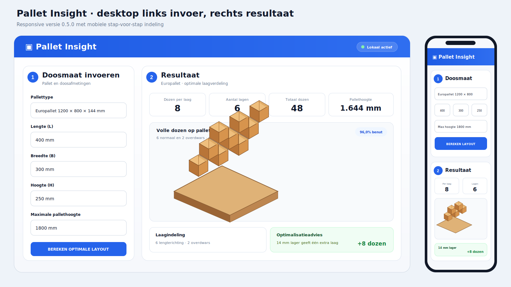

# Pallet Insight



Lokale Python-webapp die de maximale laagindeling voor gelijke dozen op een pallet zoekt. Iedere doos mag afzonderlijk 90 graden draaien. Daardoor ondersteunt de optimizer ook vrije Tetris-patronen met kleine ongebruikte ruimtes midden in de laag.

De applicatie heeft twee modi:

- **Basic** voor snelle berekeningen met de vijf belangrijkste palletresultaten.
- **Advanced** voor benutting, gewicht, contractbesparing, hoogteadvies en een downloadbare PNG-datasheet.

Op desktop staat de invoer links en het volledige resultaat rechts. Op tablet en mobiel blijven invoer en resultaat overzichtelijk onder elkaar staan.

## Starten op Windows

1. Download of clone deze repository.
2. Dubbelklik op **Start Pallet Insight.bat**.
3. De launcher maakt automatisch een afgeschermde Python-omgeving en installeert de pakketten.
4. De browser opent vanzelf op `http://127.0.0.1:8000`.

In de launcher staat ook het wifi-adres waarmee je de app op je telefoon kunt openen. Pc en telefoon moeten op dezelfde wifi zitten.

## Basic invoer

- Pallettype
- Dooslengte, doosbreedte en dooshoogte
- Maximale totale pallethoogte inclusief pallet
- Case quantity in artikelen per doos
- Optionele bedrijfsnaam voor bedrukking op iedere 3D-doos

De huidige catalogus bevat een Europallet van **1200 × 800 × 144 mm**.

## Basic resultaat

- Dozen per laag
- Aantal lagen
- Dozen per pallet
- Pallet quantity in artikelen
- Werkelijke pallethoogte
- Volledig passende 3D-palletweergave

## Advanced analyse

- Surface used en volume used
- Palletgewicht en resterende hoogte
- Contractvolume in artikelen
- Huidige en geoptimaliseerde hoeveelheid pallets
- Besparing in pallets, logistieke procenten en optionele euro's
- Advies in begrijpelijke vorm: verlaag elke doos met X mm om een extra laag toe te voegen
- Bovenaanzicht van de Tetris-laag
- PNG-datasheet voor een product data sheet

De PNG bevat onder andere bedrijfsnaam, palletbeeld, case quantity, layer quantity, pallet quantity, dozen per pallet, lagen, hoogte, benutting en contractbesparing.

## Tetris-optimalisatie

De berekening bestaat uit twee stappen:

1. Een snelle optimizer maakt direct een sterke rechte, gedraaide of gemengde indeling.
2. Google OR-Tools CP-SAT test daarna vrije plaatsingen en bewijst waar mogelijk het mathematische maximum.

De solver is niet beperkt tot volledige rijen of rechthoekige deelvlakken. Een patroon met bijvoorbeeld vijf dozen normaal, tien dozen overdwars en enkele kleine uitsparingen is toegestaan.

De API retourneert onder andere:

- `optimality_proven`: of het maximum mathematisch is bewezen
- `optimality_status`: `optimal` of `best_found`
- `theoretical_upper_bound`: bovengrens op basis van oppervlak
- `footprint_utilization_pct`: benutte palletoppervlakte
- `volume_utilization_pct`: gebruikt doosvolume tegenover het maximaal toegestane laadvolume
- `solver_time_ms`: rekentijd van de exacte solver

Een vaste regressietest gebruikt dozen van **280 × 210 mm**. De oude regio-oplossing vond 14 dozen per laag; de exacte Tetris-solver vindt en bewijst **15 dozen per laag**.

## Techniek

- Python 3.10+
- FastAPI
- Google OR-Tools CP-SAT
- Vanilla JavaScript en Canvas 2D
- Tkinter-launcher zonder extra desktopdependencies
- Pytest en GitHub Actions

## Ontwikkelaarsstart

```bash
python -m venv .venv
.venv/Scripts/python -m pip install -r requirements.txt
.venv/Scripts/python -m uvicorn app.main:app --reload
```

Op Linux/macOS gebruik je `.venv/bin/python`.

## API

Swagger-documentatie:

```text
http://127.0.0.1:8000/docs
```

Voorbeeldrequest:

```json
{
  "pallet_id": "euro",
  "box_length_mm": 400,
  "box_width_mm": 300,
  "box_height_mm": 250,
  "max_total_height_mm": 1800,
  "box_weight_kg": 8,
  "max_load_kg": 1000,
  "annual_box_volume": 83334,
  "cost_per_pallet_eur": 85
}
```

`annual_box_volume` gebruikt het aantal dozen. De webinterface rekent contractartikelen automatisch om via de ingevoerde case quantity.
